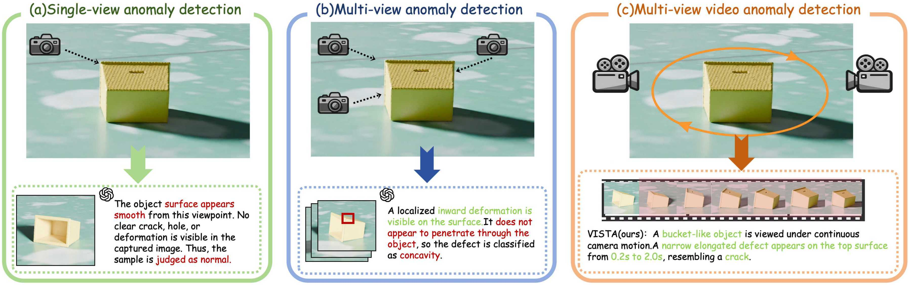
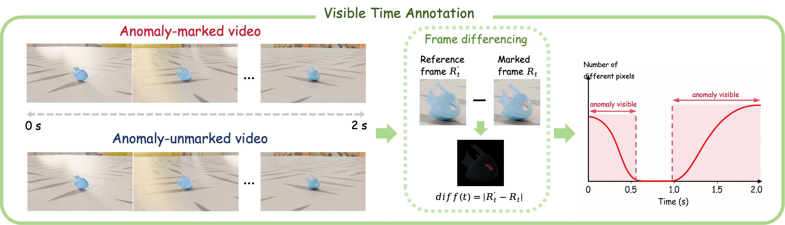
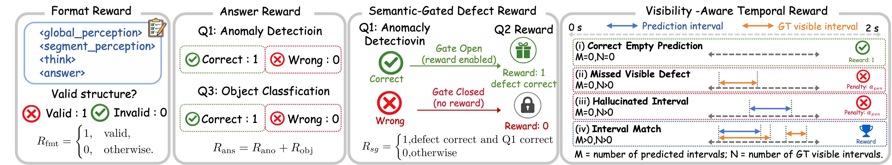
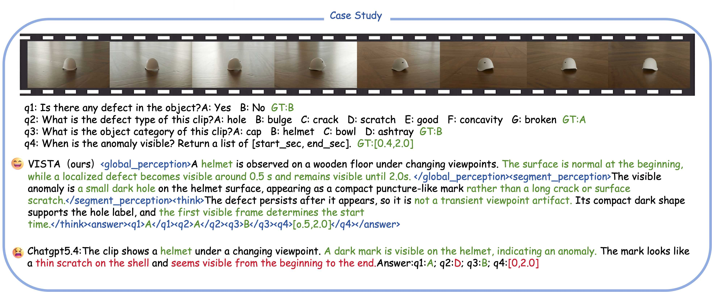

# MMVIAD

**MMVIAD: Multi-view Multi-task Video Understanding for Industrial Anomaly Detection**

This repository accompanies our paper on continuous multi-view video anomaly understanding for industrial inspection. It will host the MMVIAD dataset, the VISTA model, evaluation prompts, and benchmark code.

## Overview

Industrial inspection is rarely limited to one static image. As a camera moves around an object, structural defects such as cracks, holes, bulges, broken regions, scratches, and concavities may only become visible during a short viewpoint interval.

**MMVIAD** (Multi-view Multi-task Video Industrial Anomaly Detection) is a visibility-grounded video dataset and benchmark for this setting. Each sample is an object-centric 2-second inspection clip covering approximately 120 degrees of camera motion. The benchmark contains over 4,000 inspection clips across 48 object categories, 14 environments, and 6 structural anomaly types.

MMVIAD evaluates four coupled QA-style tasks:

- **Anomaly detection:** determine whether an anomaly is present.
- **Defect classification:** identify the structural defect type.
- **Object classification:** recognize the inspected object category.
- **Anomaly visible-time localization:** localize when the diagnostic anomaly evidence is visible.

## VISTA

**VISTA** is our reference post-training baseline for MMVIAD. It combines:

- **PS-SFT** (Perception-Structured Supervised Fine-Tuning), which initializes the model with structured reasoning traces.
- **VISTA-GRPO** (Visibility-grounded Industrial Structured Temporal Anomaly Group Relative Policy Optimization), which refines the model with semantic-gated defect rewards and visibility-aware temporal rewards.

The goal is not only to produce correct final answers, but also to ground anomaly decisions in the video interval where the defect evidence is actually visible.

## Qualitative Example

VISTA separates global object perception from localized defect evidence and links the final prediction to anomaly visible-time localization.

## Release Plan

We will publicly release:

- the **MMVIAD dataset**,
- the **VISTA model**,
- evaluation prompts and answer-parsing scripts,
- benchmark code and documentation.

The repository is under active preparation. Links and instructions will be added here.

## Citation

Citation information will be added after release.
